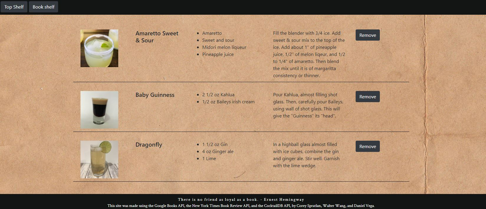
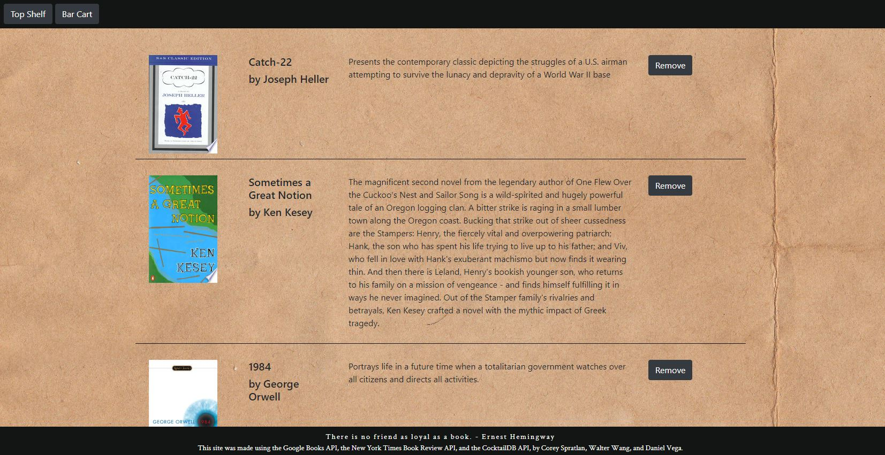
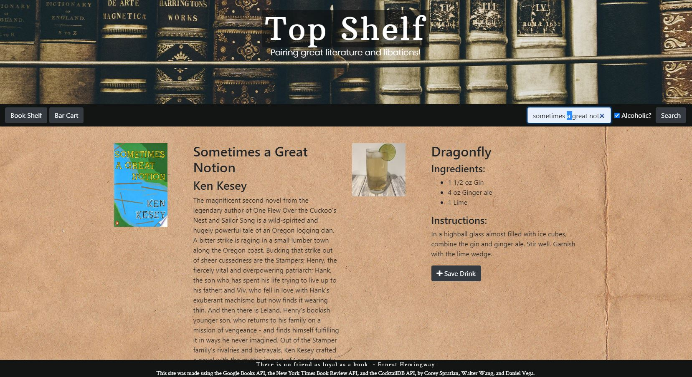

# Project1
Our first project

Minimum Viable Product (MVP)

    Who: Lovers of literature that enjoy a drink (alcoholic or non alcoholic) while reading or throwing a book club gathering.
    What: Top Shelf is an application that provides ease for a book and drink pairing.
    How: Top Shelf connects three APIs: Google Books, NYT, and The Cocktail DB so the Top Shelf user can connect a book to a drink.

User Story

    As a reader/book club member,
    I want to enjoy a book experience with a fun drink,
    So the experience is enhanced by an option provided by the app based on the user's book selection.

Criteria:

GIVEN a user wants to pair a book with a cocktail
WHEN the user searches a book title,
THEN the book title, author, and summary are displayed on the page.
WHEN the user is presented with the book information,
THEN a drink name, recipe, instructions, and image of the drink are displayed on the page next to the book information.
WHEN a user saves the book they searched,
THEN the information will be stored in their Book Cart.
WHEN a user saves the drink they searched,
THEN the information will be stored in their Bar Cart.

GitHub Repo: https://github.com/danielalexvega/Project1

Deployed Site: https://danielalexvega.github.io/Project1/index.html

 

